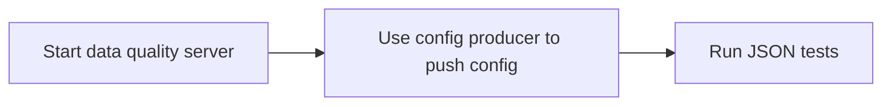

# Data Quality Check

This is a Rust-based server designed for handling protocol buffer (protobuf) descriptors and JSON validation. It exposes endpoints for loading protobuf descriptors and validating JSON against these descriptors. The server is built using the Axum framework for asynchronous web servers and Tokio for concurrency.

The tool enables the validation and checking of JSON data. You can check if a message is valid JSON, validate the presence or absence of a certain value for a specific key, and expose metrics for further analysis using tools like Prometheus and Grafana. The `data-quality-server` can be used either as a binary injected into data pipelines or as a standalone server used by multiple processes or pipelines for JSON validation.

To use the data-quality-server, start it first, then use the config-producer to upload the necessary configuration. Once the configuration is uploaded, you can proceed with the tests.



## Installation

### Assumptions:
- **Operating System**: Linux
- **Docker**: Installed

### Download:
You can download the latest binaries from the releases section.

#### Environment Variables:
Copy and rename the `env` file to `.env` file, ensuring it is in the directory where your binaries are used. Make sure you configure the variables to match your environment. Also make sure the `data` folder found at the root of this project is in the same folder.

## Usage

The `data-quality-server` can be used in two modes:
- **Server Mode**
- **Standalone Binary Mode**


### Server Mode

To start the server, run:

```bash
./data-quality-server
```


##### Options:

**--enable-metrics**  
Enable metrics collection. *Default: `false`*  
`./data-quality-server --enable-metrics`

**--worker-threads**  
Set the number of worker threads for the server. *Default: `2`*  
`./data-quality-server --worker-threads 4 --enable-metrics`

**--log-level**  
Set the log level for the server. Options are `error`, `warn`, `info`, `debug` and `trace`. *Default: `info`*  
`./data-quality-server --worker-threads 4 --enable-metrics --log-level info`

### Standalone Mode

##### Option

**--json**  
Provide a JSON string for validation in a standalone binary mode. *Default: `None`*  
`./data-quality-server --json '{"key1": "value1", "key2": 42}'`


When running the binary in this manner, no web server is started. This enables you to use data-quality-server in pipelines where no further network connectivity is possible or needed.


### Config-producer-proto
After starting the data-quality-server, you need to upload compiled protobuf definitions. This requires the **protobuf-compiler** and its dependencies installed. The `data` folder found in the project root should be in the same folder as the built `config-producer-proto` binary.

##### Compile protobuf and upload
Check the configured folder for protobuf definitions, compile them, and upload them to the data-quality-server

`./config-producer-proto`

##### Options:
**--loop**  
Enable looping to check for .proto file updates. *Default: `false`*  
`./config-producer-proto --loop --interval 30`

**--interval**  
Set the interval (in seconds) to check for .proto file updates. *Default: `30`*  
`./config-producer-proto --loop --interval 30`

**--log-level**  
Set the log level for the application. Options are `error`, `warn`, `info`, `debug` and `trace`. *Default: `info`* 
`./config-producer-proto --loop --interval 30 --log-level info`

##### Docker
Alternatively, you can use Docker to run the config-producer-proto:

Config-producer-proto can also be built and used using:
```
docker compose -f docker-compose-config-producer.yml run config_producer
```
This will build and run a container containing all the needed dependencies and uses the env-docker environment file.


### Load test
Using this tool an optimal configuration can be found for the settings available in data quality server.

##### Options:

**--log_level**  
The logging level for the application. Options are `error`, `warn`, `info`, `debug` and `trace`. *Default: `info`* 

**--iterations**  
The number of times to repeat the load test. *Default: `1`*

**--semaphore_permits**  
The number of concurrent requests that can be made at once. *Default: `100`*

**--num_requests**  
The number of requests to send in each iteration. *Default: `2000`*

**--pool_max_idle_per_host**  
The maximum number of idle connections per host in the HTTP client pool. *Default: `100`*

**--timeout_secs**  
The timeout duration for each HTTP request, in seconds. *Default: `100`*

**--generate_config**  
A flag to generate load test configurations with custom parameters. When set to `true`, it triggers the generation of configurations. *Default: `false`*

**--semaphore_permits_range**  
A range for `semaphore_permits` in the format `start,end,step`. This will override the default value and generate multiple configurations based on the provided range. For example, `--semaphore_permits_range 10,200,10` will create configurations with semaphore permits ranging from 10 to 200, stepping by 10.

**--pool_max_idle_per_host_range**  
A range for `pool_max_idle_per_host` in the format `start,end,step`. This will override the default value and generate multiple configurations based on the provided range. For example, `--pool_max_idle_per_host_range 10,100,10` will create configurations with idle connections per host ranging from 10 to 100, stepping by 10.

**--num_requests_range**  
A range for `num_requests` in the format `start,end,step`. This will override the default value and generate multiple configurations based on the provided range. For example, `--num_requests_range 500,5000,100` will create configurations with the number of requests ranging from 500 to 5000, stepping by 100.


#### Single test
```
./load-test --iterations 3 --semaphore_permits 200 --num_requests 1000
```
#### Test multiple settings
You can customize the ranges for semaphore_permits, pool_max_idle_per_host, and num_requests through the CLI when generating configurations. For example:
```
./load-test --generate-config --semaphore-permits-range 10,100,10 --pool-max-idle-per-host-range 20,80,20 --num-requests-range 1000,3000,500
```
This will create a file in your path (load_test_configs.json) by iterating over your defined range of parameters.

Running the load test will now automatically load the generated config file.
```
./load-test
```

## Examples:

Check if JSON can be serialized using the protobuf definition MyMessage and validate that field with key2 contains the number 42

##### curl - json
```
curl -X POST http://192.168.178.106:8080/validate   -H "Content-Type: application/json"   -d '{
    "protobuf": "MyMessage", 
    "json": {"key1": "example_value", "key2": 42, "key3": true}, 
    "json_escaped": false,
    "field_check": true,
    "field_name": "key2",
    "field_value_check": 42
  }'
```

##### curl - escaped json
```
curl -X POST http://192.168.178.106:8080/validate \
  -H "Content-Type: application/json" \
  -d '{
    "protobuf": "MyMessage", 
    "json": "{\"key1\": \"example_value\", \"key2\": 42, \"key3\": true}", 
    "json_escaped": true,
    "field_check": true,
    "field_name": "key2",
    "field_value_check": 42  }'
```

##### wget
```
wget --quiet \
     --method=POST \
     --header="Content-Type: application/json" \
     --body-data='{
         "protobuf": "MyMessage",
         "json": {
             "key1": "example_value",
             "key2": 42,
             "key3": true
         },
         "json_escaped": false,
         "field_check": true,
         "field_name": "key2",
         "field_value_check": 42
     }' \
     -O - http://192.168.178.106:8080/validate
```

### pipeline integration
create intermediate file, this could be a message produced by a Kafka consumer 
```
echo '{
  "protobuf": "MyMessage",
  "json": '$(cat data/input/test/example.json)' ,
  "json_escaped": false,
  "field_check": true,
  "field_name": "key2",
  "field_value_check": 42
}' > request.json
```

##### curl
```
curl -X POST http://192.168.178.106:8080/validate \
  -H "Content-Type: application/json" \
  -d @request.json
```

##### httpie
```
http --verbose POST 192.168.178.106:8080/validate @request.json
```

##### wget
```
wget --quiet \
     --method=POST \
     --header="Content-Type: application/json" \
     --body-file=request.json \
     -O - http://192.168.178.106:8080/validate
```


### Build yourself:
Data-quality-check is written in Rust. If you want to build it yourself, you need to have Rust and Cargo installed on your system.

#### Installing Rust and Cargo
To install Rust and Cargo, you can use the official Rust installation script, `rustup`.

Run the following command in a terminal to install Rust:

`curl --proto '=https' --tlsv1.2 -sSf https://sh.rustup.rs | sh`

After installation, configure your current shell to use Rust:

`source $HOME/.cargo/env`

Verify the installation by checking the version of Rust and Cargo:

`rustc --version`
`cargo --version`

```
git clone https://github.com/data-quality-check.git
cd data-quality-check
cargo build --release
```

#### Build binaries using Docker
If you don't want to install Rust and Cargo on your system you can use an integrated builder-image.
run:
```
docker-build-all-binaries.sh
```
and check the docker-builds folder

### Troubleshooting:
#### Can't connect? 
Check your firewall settings
#### Check Docker Service
Ensure Docker service is running:

`sudo systemctl status docker`

#### Check Docker Daemon Socket
Verify Docker daemon connectivity:

`curl --unix-socket /var/run/docker.sock http://localhost/_ping; echo`

#### Too many connections - error?

set number of connections a process can open simultaneously
```
ulimit -n
```
increase the limit temporarily for the current session:
```
ulimit -n 100000
```
make this change permanent, open
```
/etc/security/limits.conf
```
Add or modify the following lines:
```
* soft nofile 100000
* hard nofile 100000
```

#### Check env vars in container
```
docker compose exec config_producer env
```